  <h1>🏰 King Bug Castle (KGC)</h1>
  
<strong>A fully-featured Private Server & Reverse Engineering Toolkit for "King God Castle" (v170.1.00 – v171.1.00)</strong>

  
  
  
  

 

> **⚠️ DISCLAIMER:** This is a fan-made, non-profit project created **strictly for educational, interoperability, and research purposes**. It is not affiliated with, endorsed by, or associated with Awesomepiece. The server-authoritative game logic is fully emulated locally. The client is only patched to bypass certificate pinning and local anti-cheat (XIGNCODE3) checks to allow for offline development and local traffic interception.

---

## 📖 Overview

**King Bug Castle** is an ambitious reverse-engineering project that reconstructs the entire backend API for the mobile game *King God Castle* (`com.awesomepiece.castle`). 

By dumping the IL2CPP metadata and intercepting network traffic, we have successfully mapped and answer **all 351 REST API endpoints** the client can call, 400+ wire models, and recreated a local FastAPI server that fully emulates the `axis-game` infrastructure. This allows for complete offline gameplay, data manipulation (Gold, Gems, Levels), custom artifact testing, and deep-dive mechanics research without ever touching the live production servers.

## ✨ Core Features

* 🚀 **Full API Emulation**: A robust Python/FastAPI server replicating the exact behavior of `axis-game.awesomepiece.com` and `kgc-k8s-1.awesomepiece.com`.
* 🛡️ **Client Binary Patching (ARM64)**: Automated Python pipeline (`rebuild_arm64.py` for v170, `build_private.py` for v171/v172) that patches `libil2cpp.so` to defeat SSL/TLS pinning and `CertificateHandler` checks.
* 📦 **XIGNCODE NEO Unpacker**: Modern versions ship no `libil2cpp.so` - the game code is packed inside the anti-cheat library. `server/patchers/unpack_neo.py` recovers a linkable ELF from it offline (RSA-1024 → ChaCha20 → LZ4), so the build injects that build's *own* game code.
* 👻 **XIGNCODE3 Bypass**: Emulates the Wellbia anti-cheat seed exchange (`/auth/xcdSeed`) to allow the client to boot without verification crashes.
* 🛠️ **`kgc-cli` Toolkit**: A proprietary command-line utility used for lightning-fast asset extraction, S3 CDN mirroring, and XML data diffing.
* 🗃️ **Hot-Reloading State**: Complete control over your account. Player state lives in SQLite (`server/state/players.db`, via `playerdb.py`); edit it from the web dashboard or by hand, and `data/*.json` for response shapes - both take effect per-request, no restart.

---

## 🛠️ Environment & Prerequisites

To successfully run the backend and deployment scripts, your system must meet the following environment requirements:

* **OS**: **Linux, macOS, or Windows.** The server and build pipeline are pure Python + a few Java/adb CLI tools. (redroid is Linux-only, but BlueStacks / LDPlayer / real devices work on any OS.)
* **Python**: Python 3.9 or higher.
* **System Tools** (all on `PATH`): `apktool`, `apksigner`, `zipalign`, `adb`, and a JRE. `python3 setup.py` checks them and prints per-OS install hints. **No Android NDK/SDK needed** - the native `.so` pieces ship prebuilt.
* **Device**: any of **redroid** (Linux/Docker, run with `androidboot.redroid_gpu_mode=guest`), **BlueStacks**, **LDPlayer**, or a **real Android phone** (USB debugging).
* **One-shot setup**: `python3 setup.py` then `pip install -r server/requirements.txt`. See **[SETUP.md](SETUP.md)**.

---

## 🗺️ Architecture & Workflow

The private server emulator is designed to intercept and process all traffic from the game client by fully replicating the backend architecture of King God Castle.

### System Components

1. **FastAPI Backend Emulator (`server.py` + the route modules beside it)**: Acts as the central game server (`axis-game.awesomepiece.com`), answering all 351 endpoints the client can call. Response *rules* are data, not code - flat JSON in `server/data/` - while live player progression is SQLite (`server/state/players.db`, WAL, one row per account, always through `playerdb.py`).
2. **Binary Patcher (`rebuild_arm64.py` for v170, `build_private.py` for v171/v172)**: Before the game can connect to the emulator, the client's `libil2cpp.so` must be modified. This automated pipeline injects assembly to bypass SSL pinning (forcing `CertificateHandler.ValidateCertificate` to always return true) and skips NRE (NullReferenceException) triggers in the UI. Modern versions pack `libil2cpp.so` inside XIGNCODE NEO until `patchers/unpack_neo.py` recovers one from the anti-cheat packer.
3. **Local XML CDN**: The game downloads "Patch Assets" (XML tables) at boot. We mirror the official S3 CDN locally. The backend directs the game to our local CDN (`kgc-cdn-1.awesomepiece.com`), allowing us to inject custom items, text modifications, and rule changes via `rebuild_xml_bundle.py`.
4. **XIGNCODE3 Stub + native hook host (`jni/stub.cpp`)**: The proprietary anti-cheat module prevents the game from booting if it can't reach the Wellbia servers. We replace the heavy `libxigncode.so` with our own native library that registers no-op `ZCWAVE_*` JNI methods (faking the `/auth/xcdSeed` handshake and bypassing local integrity checks), then goes further — a worker thread dlopen's `libil2cpp.so` and installs il2cpp method hooks for in-game features (an in-battle GameUnit stat poller, and a custom Inbox-mail text hook). Two hook techniques are used depending on how the target method is invoked (methodPointer swap for Unity engine messages, inline detour for direct C# calls).

```mermaid
graph TD
    Client[📱 Android Client / Emulator]
    FastAPI[⚡ Local FastAPI Server]
    CDN[📦 Local XML CDN]
    XIGNCODE[🛡️ Xigncode Stub + il2cpp hooks]
    Data[(JSON rules + SQLite saves)]

    Client -- "HTTPS (Bypassed TLS via ARM64 Patch)" --> FastAPI
    Client -- "Fetch XML Patch Bundles" --> CDN
    FastAPI <--> Data
    Client <-->|"Faked Seed Handshake"| XIGNCODE
    
    style Client fill:#2D3748,stroke:#4A5568
    style FastAPI fill:#009688,stroke:#00796B
    style Data fill:#D69E2E,stroke:#B7791F
    style CDN fill:#3182CE,stroke:#2B6CB0
```

---

## 🧭 Documentation Hub

We have heavily documented the entire teardown and rebuild process. Depending on what you want to do, pick your path:

### 🎓 Taking over / maintaining this project
Inheriting the repo, or coming back to it after a while?
👉 **Read [HANDOVER.md](HANDOVER.md)** - the day-1 checklist, the recurring job, and the trap
ledger (every expensive mistake, with its symptom). Start here before changing anything.

### 🚀 Run your own server (start here)
Cloned the repo and want your own working server + a client for redroid / BlueStacks / LDPlayer / a real phone?
👉 **Read [SETUP.md](SETUP.md)** - one script, any OS, any device.

### 🛠️ Operate & modify your server (grant items, unlock content, build test stages)
Server running and you want to grant currency/skins/treasures, un-gate content, or make an all-dummy
test stage? 👉 **Read the [Operator Knowledge Base](docs/README.md)** - practical playbooks.

### 👨‍💻 For Backend Developers & Contributors
Want to dig into the server internals, patch pipeline, and API responses?
👉 **Read the [Server Setup Guide & Workflow](server/README.md)**

### 🎮 For End-Users / Players
Did you just download the `.zip` release and want to know how to install it on your device/emulator?
👉 **Read the [Player Installation Guide](README_PLAYER.md)**

### 🧠 For Reverse Engineers
Want to understand how we dumped IL2CPP, mapped the 351 routes, defeated SSL pinning, and how the S3 CDN delivers XML patches?
👉 **Read the [Knowledge Base & Teardown Notes](KNOWLEDGE.md)**

---

## 📂 Repository Layout

| Directory | Purpose |
| --- | --- |
| 📁 `docs/` | Operator knowledge base - playbooks for granting items, unlocking content, editing stages/master data ([`docs/README.md`](docs/README.md)). |
| 📁 `server/` | The core FastAPI backend, its route modules, and the client build scripts (`rebuild_arm64.py`, `build_private.py`). |
| 📁 `server/data/` | Static JSON models and response templates (Docs: [`server/data/README.md`](server/data/README.md)). |
| 📁 `server/patchers/` | The APK/binary patchers the build scripts call - host rebind, package rename, metadata edits, and `unpack_neo.py` (recovers `libil2cpp.so` from the anti-cheat packer). |
| 📁 `server/xml_live/` | Live-edited master data. Edit here, then `rebuild_xml_bundle.py` to push it to the client. |
| 📁 `server/webui/` | The admin dashboard (Vue 3, vendored - no build step). |
| 📁 `api/` | Auxiliary integrations and external tool endpoints. |
| 📁 `scripts/` | Shell and Python automation scripts for fetching CDN data and extracting assets. |
| 📁 `xml_history/` | Pristine per-patch snapshots of the CDN master data (reference; not what the server reads). |
| 📁 `il2cpp/` & `ghidra/` | Dumped metadata (`dump.cs`), string literals, and Ghidra project files. |
| ⚙️ `kgc-cli` | The core executable binary tool for data operations. |

---

## 🤝 Contributing

This project relies on continuous mapping as the game updates. If you find an unmapped route returning a `500` or an empty object, capture the real traffic using `mitmproxy`, find the matching model in `server/generated/models.json`, and add the override in `server.py` or `server/data/static_overrides.json`.

---

## 💖 Support & Donate

If you found this project helpful for your research, reverse-engineering learning, or just had fun messing around with the private server, consider supporting the development! Maintaining this project requires constant teardowns of new game updates.

